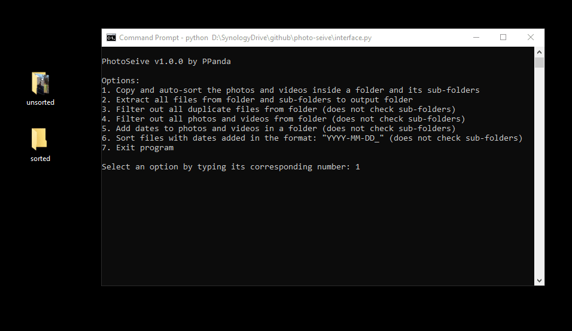

# PhotoSeive
PhotoSeive is a Python command line application for sorting photos and videos.
To use the program, install `ExifRead` using `pip install ExifRead`. Then run
`interface.py` to access the menu options.

